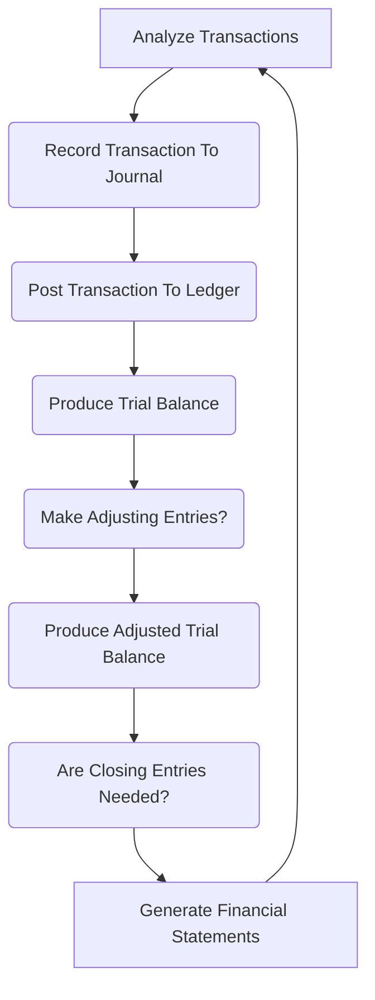

9 steps:

## 1. Identify & Analyze Transactions:

- Identify which accounts are impacted by transaction
- Include purchases, sales, payments, receipts, etc.

## 2. Record Transactions To Journal:

- Transactions are recorded chronologically.
- Date, account titles, debits/credits amounts, & brief descriptions.

## 3. Post Transactions To General Ledger:

- Individual account balances in the general ledger are updated based on the journal entries.

## 4. Prepare Unadjusted Trial Balance:

- The Trial Balance lists all accounts in the ledger with their respective balances.  
- The Trial Balance does not highlight the accouonting equation, but it shows all normal balances.  

However, it might not fully reflect the current state due to accruals & prepayments.

## 5. Make Adjusting Entries (If Needed):

- For accuracy, adjustments are made for unrecorded expenses, accrued revenues, prepaid expenses, depreciation, etc., bringing the account balances closer to their actual economic value.

## 6. Prepare An Adjusted Trial Balance:

- After incorporating adjustments, a new trial balance is generated,
- This reflects a more accurate picture of the company's financial state at a specific point in time.

## 7. Prepare Financial Statements:

- Using the adjusted trial balance as a starting point, financial statements like the income statement, statement of equity and balance sheet are created.

## 8. Close the Books (If Needed):

- This step is particularly relevant for periodic reporting (e.g., monthly, quarterly).  
- Closing involves transferring temporary account balances (revenue, expense) to permanent accounts (retained earnings), preparing them for a new reporting period.

## 9. Archive Records:

- All transaction details, journal entries, & supporting documents are securely stored for future reference & potential audits.

> #### NOTE: *This is a general overview, & specific details or steps might vary depending on the business size, complexity, & industry practices. Additionally, software can automate much of this process, but underst&ing the underlying concepts remains crucial.*
{: .block-tip }