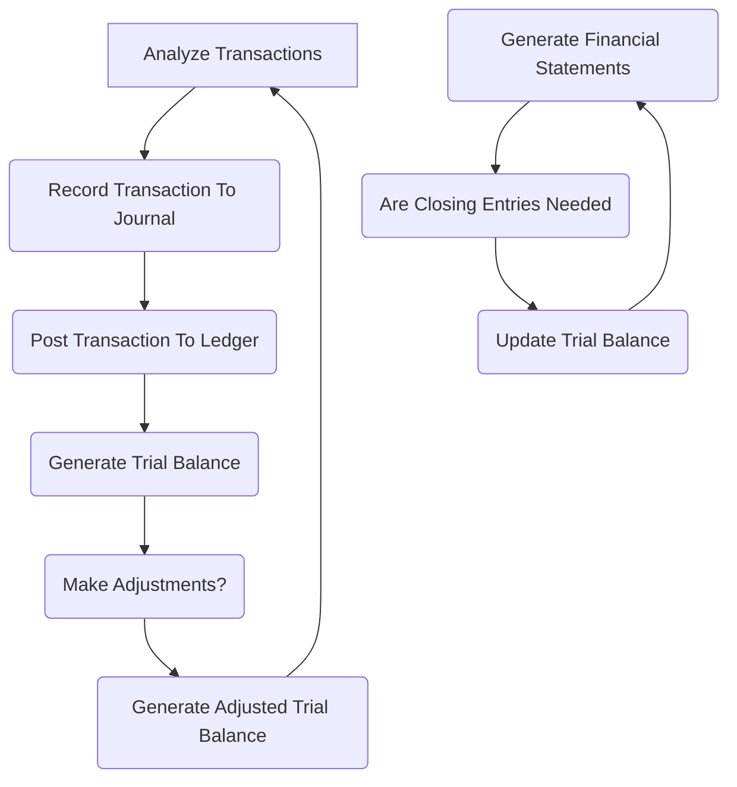

9 steps:

## 1. Identify & Analyze Transactions:

- Identify which accounts are impacted by transaction
- Include purchases, sales, payments, receipts, etc.

## 2. Record Transactions To Journal:

- Transactions are recorded chronologically.
- Date, account titles, debits/credits amounts, & brief descriptions.

## 3. Post Transactions To General Ledger:

- Individual account balances in the general ledger are updated based on the journal entries. Debits increase asset & expense accounts, while credits decrease them. Conversely, credits increase liability, equity, & revenue accounts, & debits decrease them.

## 4. Prepare Unadjusted Trial Balance:

This report lists all accounts in the ledger with their respective balances, showcasing a preliminary overview of the financial position. However, it might not fully reflect the current state due to accruals & prepayments.

## 5. Make Adjusting Entries (Optional):

To ensure accuracy, adjustments are made for unrecorded expenses, accrued revenues, prepaid expenses, depreciation, etc., bringing the account balances closer to their actual economic value.

## 6. Prepare an Adjusted Trial Balance:

After incorporating adjustments, a new trial balance is generated, reflecting a more accurate picture of the company's financial st&ing at a specific point in time.

## 7. Prepare Financial Statements:

Using the adjusted trial balance as a starting point, financial statements like the balance sheet & income statement are created, portraying the company's financial position & performance.

## 8. Close the Books (Optional):

This step, particularly relevant for periodic reporting (e.g., monthly, quarterly), involves transferring temporary account balances (revenue, expense) to permanent accounts (retained earnings), preparing them for a new reporting period.

## 9. Archive Records:

All transaction details, journal entries, & supporting documents are securely stored for future reference & potential audits.

*This is a general overview, & specific details or steps might vary depending on the business size, complexity, & industry practices. Additionally, software can automate much of this process, but underst&ing the underlying concepts remains crucial.*
