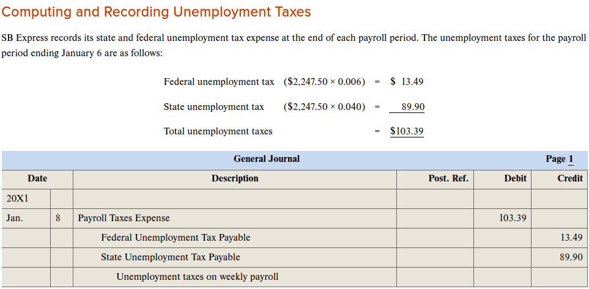
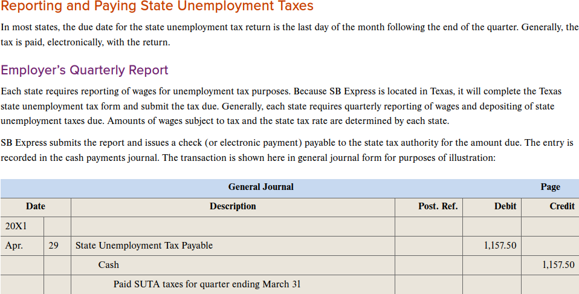

Chap 11 Pyroll Taxes

**This NEEDS a Flowchart or timeline chart**

Objectives

[1]

Payment of Payroll taxes

- EFTPS Electronic Federal Tax Payment System - 

EFTPS must be used if Payroll is >= $200,000, ow a 10% penalaty is pssible

- Term

- Lookback period

[2]

[3]

## SS and Medicare TAxes

[4]

[5]

[6]

## Recording payment of taxes withheld

## Quartlery summary of EArning recrods

[8]

[9]

## Employer’s Quarterly Federal Tax Return, 

- Employer’s Quarterly Federal Tax Return, Form 941 - Preprinted government form used by the employer to report payroll tax information relating to social security, Medicare, and employee income tax withholding to the Internal Revenue Service

[10]

[11]

https://www.irs.gov/pub/irs-prior/f941--2024.pdf

## Wage and Tax Statement, Form W-2

- Wage and Tax Statement, Form W-2 - Preprinted government form that contains information about an employee’s earnings and tax withholdings for the year

- Withholding statement - See Wage and Tax Statement, Form W-2

[13]

## Transmittal of Wage and Tax Statements, Form W-3

- Transmittal of Wage and Tax Statements, Form W-3 - Preprinted government form submitted with Forms W-2 to the Social Security Administration

[14]

## Sectiopn 2

## Unemployment insurance program

- Unemployment insurance program - A program that provides unemployment compensation through a tax levied on employers

- Experience rating system - A system that rewards an employer for maintaining steady employment conditions by reducing the firm’s state unemployment tax rate

- Merit rating system - See Experience rating system

## Questions

(chap11.section1.q.png)

